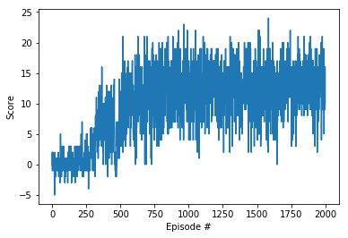

# Implementation

## Algorithm

The choice of algorithm to solve the Udacity banana collector game is deep Q-learning with experience replay. I also implemented Dueling DQN, double DQN and priority experience replay.

## hyperparameters

The choice of the hyperparameters is as follows.

- LR = 0.0005
- BUFFER_SIZE = 10000
- BATCH_SIZE = 64
- GAMMA = 0.99
- UPDATE_EVERY = 4
- TAU = 0.001
- ALPHA = 1
- EPI = 0.001
- BETA = 1
- ITA = 0.25

## model architecture

This project uses two different neural networks, 1st is normal deep q-learning network, its architecture is 

| |input units|output units|
|---|---|---|
|input layer|37|64|
|hidden layer|64|32|
|output layer|32|4|

except for output layer, the activation function for all layers is relu.

2nd is dueling DQN, its architecture is 

| |input units|output units|
|---|---|---|
|input layer|37|64|
|hidden layer|64|32|
|value layer|32|1|
|advantage layer|32|4|

the activation function for all the layers is relu, in the original paper, there are two versions of output, here, I use the 2nd version, which is `Q=value(x) + advantage(x) - mean of advantage(x)`

### choice of fully connected layer units

For this project, the choice of the fully connected layer units are 64 and 32. I have experimented other combinations such as [128, 64] or [256, 128], however, they can't solve the environment within 2000 episodes, in some cases, they learned nothing after 2000 episodes.

## Performance between different implementation

### DQN without soft update

### DQN with soft update

### double DQN

### dueling DQN

### dueling and double DQN

### priority experience replay agent
