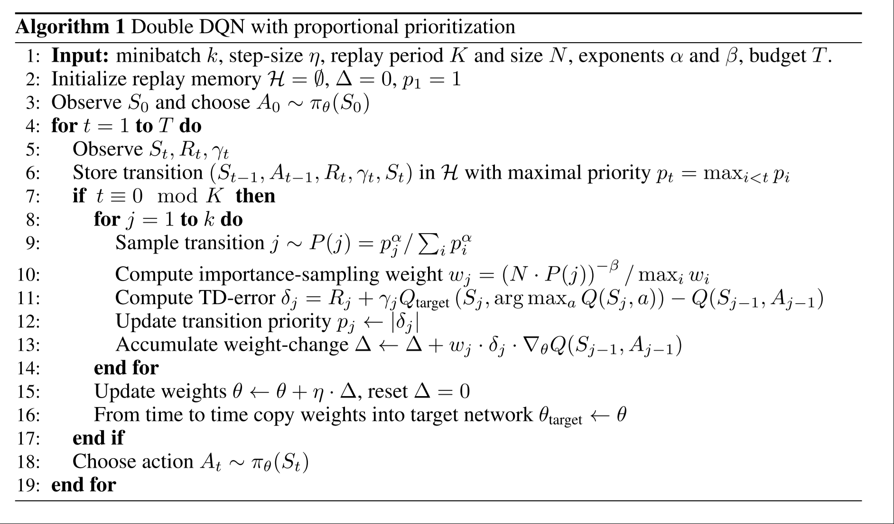

# Performance

## Algorithm

The choice of algorithm to solve the Udacity banana collector game is deep Q-learning with experience replay. I also implemented Dueling DQN, double DQN, and priority experience replay.

## hyperparameters

The choice of the hyperparameters is as follows.

- LR = 0.0005
- BUFFER_SIZE = 10000
- BATCH_SIZE = 64
- GAMMA = 0.99
- UPDATE_EVERY = 4
- TAU = 0.001
- ALPHA = 1
- EPI = 0.001
- BETA = 1
- ITA = 0.25

## model architecture

This project uses two different neural networks, 1st is a normal deep q-learning network, its architecture is 

| |input units|output units|
|---|---|---|
|input layer|37|64|
|hidden layer|64|32|
|output layer|32|4|

except for the output layer, the activation function for all layers is relu.

2nd is dueling DQN, its architecture is 

| |input units|output units|
|---|---|---|
|input layer|37|64|
|hidden layer|64|32|
|value layer|32|1|
|advantage layer|32|4|

the activation function for all the layers is relu, in the original paper, there are two versions of output, here, I use the 2nd version, which is `Q=value(x) + advantage(x) - mean of advantage(x)`

### choice of fully connected layer units

For this project, the choice of the fully connected layer units is 64 and 32. I have experimented other combinations such as [128, 64] or [256, 128]; however, they can't solve the environment within 2000 episodes, in some cases, they learned nothing after 2000 episodes.

## Performance between different implementation

### DQN without soft update
The agent solved the environment in 818 episodes, but the average reward over 100 episodes doesn't improve till 2000 episodes finished.  

### DQN with soft update
The agent solved the environment in 424 episodes, the best average reward over 100 episode is close to 16.  

### double DQN
The agent solved the environment in 420 episodes, the best average reward over 100 episode is over 16. Its performance is more stable compared to normal DQN.  

### dueling DQN
The agent solved the environment in 427 episodes, the best average reward over 100 episode is over 16. Its performance is more stable compared to normal DQN.  

### dueling and double DQN
The agent solved the environment in 461 episodes, the best average reward over 100 episode is over 16. Its performance is more stable compared to normal DQN and slightly better than each of dueling or double DQN.  

### Prioritized experienced replay agent
Although I spend a lot of time to tune hyperparameters, the PER agent hardly solves the environment within 2000 episodes, most of the time it stuck at 10 for average reward over 100 episode.

## implementation reference

### DQN with experience replay
The algorithm comes from the original paper, and most of my codes are from Udacity DRLND course. However, in the original paper, the author didn't mention soft update, so I implemented two agents, one is with soft update, one is not. Based on my experiments, DQN with soft update is much better than DQN without soft update, at least in this project.

[source](https://storage.googleapis.com/deepmind-media/dqn/DQNNaturePaper.pdf)

### Dueling DQN

  
[source](https://arxiv.org/abs/1511.06581)  
  
[source](https://arxiv.org/abs/1511.06581)

### Double DQN

[source](https://arxiv.org/abs/1509.06461)

### Prioritized experienced replay
To implement Prioritized experience replay, I need a data structure called sum tree, because of the naive approach like using an array and sort it whenever sampling is too inefficient; the sum tree implementation comes from this [link](https://github.com/jaara/AI-blog/blob/master/SumTree.py). However, this implementation seems to have a little bug, that is, sometimes it'll return empty data (haven't written yet), so I add a max_write to indicate max dataIdx that has data, and if self._retrieve() returns index > max_write, return max_write instead.  Another modification is when adding data, the priority should be equal to `max(priorities)`, so I add another array to store data priorities.  
I also need a Priority replay buffer to handle things like adding priority to sum tree, return weights to the agent and correctly update the error of the sampled data.  
Finally, I need an agent that can properly learn data from the priority replay buffer, this is the most challenge part because the original paper says we should update the model weight by this formula `gradient*td errors*importance-sample weight*ITA`. I tried many ideas include directly modify the `torch.tensor.grad`. After some research, I decided to use the fact that if `grad = F.mse_loss(x, y)`, then `c^2 * grad = F.mse_loss(cx,cy)` to update the model weight.

[source](https://arxiv.org/abs/1511.05952)

# reference 

1. [DQN with experience replay](https://storage.googleapis.com/deepmind-media/dqn/DQNNaturePaper.pdf)
2. [Dueling DQN](https://arxiv.org/abs/1511.06581)
3. [Double DQN](https://arxiv.org/abs/1509.06461)
4. [Prioritized experienced replay](https://arxiv.org/abs/1511.05952)

